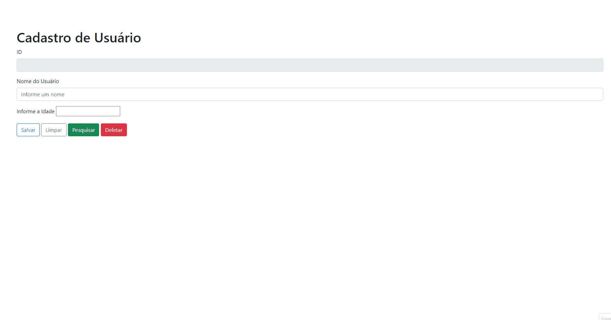

# Projeto cadastro de usuário 

## Finalidade do projeto

O projeto visa colocar em pática conceitos de frontend e backend criando um sistema de cadastro, com framework's como Bootstrap e Spring Boot persistindo os dados em um banco de dados.

## Descrição

Sistema de cadastro de usuário simples usando no frontend o framework bootstrap com a biblioteca JQuery, e no backend a linguagem de programação Java com o framework Spring Boot, onde o usuário poderá salvar, editar, pesquisar e deletar ou seja, todo procedimento do CRUD, com todos os dados sendo persistidos no banco de dados PostgreSQL.

Tecnologias usadas :

### Frontend
| Tecnologia  | Icone |
| ---  | ---  |
|  Html     |           |
|CSS    |       |
|  JavaScript     |           |
|  Bootsratp     |         |
|   JQuery            |        
    

### Backend
| Tecnologia | Icone  |
|--- | --- |
| Java |   |
|Spring   |   |

### Banco de dados
| Banco  |  Icone  |
|---|---|
| PostgreSQL  |    |

### Software de Teste
| Software | Icone |
|---|---|
| Postman |  |

## Apresentação do Projeto 🚀🚀

<h3> Tela inicia </h3>

### Criando um usuário
<h1 align="center">
    </h1>

### Pesquisando um usuário na base de dados

Para pesquisar o usuário basta digitar o nome dele, mesmo que seja digitado o nome maiúsculo ou minusculo se tiver esse nome na base de dados ele mostra o usuário na tela.

>
Ex: Jorge Gomes, mesmo que o nome comece com a primeira letra maiúscula e foi digitado tudo minúsculo ou só o primeiro nome sem o sobrenome, ele mostrará o nome do usuário na tela.

<h1 align="center">
    </h1>

De mesma forma não precisa digitar o nome completo do usuário para se obter o usuário, também pode digitar uma parte do nome ou até mesmo uma letra e virá todos os usuários que estão cadastrados com a letra que foi digitada, o correto e digitar o nome completo pois trará o usuário específico.

<h1 align="center">
    </h1>

### Editando um usuário

Para editar um usuário basta pesquisar por seu nome, e clicar no botão editar, que irá voltar os dados para o formulário para ser editado.

<h1 align="center">
    </h1>

### Deletando um usuário

Para deletar um usuário tem que pesquisar por seu nome e clicar no botão delete dentro do pop-up de busca, ou clicar no botão delete do formulário do cadastro, conforme é mostrado na demonstração abaixo.

<h1 align="center">
    </h1>

### Limpando o formulário

<h1 align="center">
    </h1>

